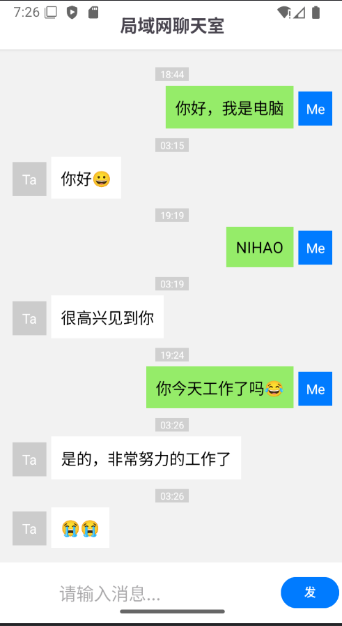
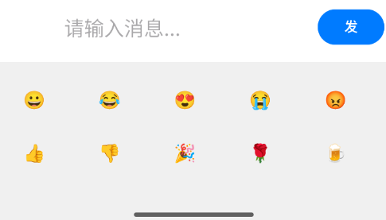
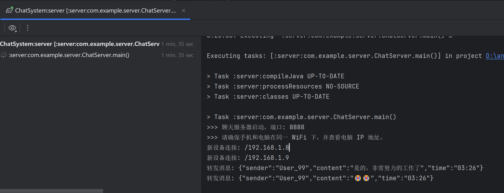

# 📱 Android LAN Chat System (局域网聊天系统)


基于 **Java 原生 Socket (BIO)** 和 **Android** 实现的简易局域网即时通讯系统。

本项目涵盖了 Android 客户端 UI 开发、SQLite 数据库本地存储、服务端多线程网络编程以及 JSON 通信协议设计。支持真机与模拟器、真机与真机在同一 WiFi 环境下的即时互通。

---

## ✨ 项目演示 (Demo)

| 聊天主界面 | 表情输入面板 | 服务端日志 |
| :---: | :---: | :---: |
|  |  |  |

> *注：请在项目根目录下创建 `screenshot` 文件夹并放入截图。*

---

## 🛠 功能特性 (Features)

- **即时通讯**：基于 TCP 长连接，实现低延迟的消息收发。
- **多端互联**：支持 Android 真机、模拟器与 PC 服务端无缝互通。
- **智能 IP 识别**：客户端自动判断运行环境（真机/模拟器），自动切换连接 IP (`10.0.2.2` 或 局域网 IP)。
- **消息持久化**：采用 SQLite 数据库存储聊天记录，重启应用不丢失数据。
- **UI 交互**：使用 `RecyclerView` 展示消息列表，区分气泡布局。

---

## 🏗 技术栈 (Tech Stack)

### Client (Android)
- **Language**: Java
- **UI**: RecyclerView, Adapter, LinearLayout, GridView
- **Database**: SQLite (SQLiteOpenHelper)
- **Network**: `java.net.Socket`, `Thread`, `Handler`
- **Data**: JSON (`org.json`)

### Server (Java PC)
- **Core**: Java SE (BIO Model)
- **Concurrency**: `ExecutorService` (ThreadPool)

---

## 🚀 快速开始 (Getting Started)

只需简单三步，即可在本地运行本项目。

### 1. 环境准备 (Prerequisites)

在开始之前，请确保你的开发环境满足以下要求：

- [x] **IDE**: Android Studio Ladybug 或更高版本
- [x] **JDK**: Java Development Kit 1.8 +
- [x] **设备**: 一部 Android 真机（已开启 USB 调试）或 Android 模拟器
- [x] **网络**: ⚠️ **关键**：手机和电脑必须连接同一个 WiFi，或者电脑连接手机开启的热点。

### 2. 启动服务端 (Start Server)

服务端负责消息的中转，必须先于客户端启动。

1. 在 Android Studio 中找到 `server` 模块。
2. 打开 `src/main/java/com/example/chatsystem/ChatServer.java`。
3. 点击 `main` 方法旁的运行按钮。

**验证启动：**
当控制台输出以下日志时，说明服务端已就绪：

```text
>>> 聊天服务器启动，端口: 8888
>>> 新设备连接: /127.0.0.1 (示例)
```

> **注意**：如果是首次运行，Windows 防火墙可能会弹出警告，请务必勾选 **“允许访问 (专用网络 & 公用网络)”**，否则手机无法连接。

### 3. 配置与运行客户端 (Run Client)

客户端配置了智能 IP 切换，但仍需手动填写一次电脑的真实 IP。

1. **获取电脑 IP**：
   在终端/CMD 输入 `ipconfig` 查看 IPv4 地址（例如 `192.168.1.5`）。

2. **修改配置**：
   打开 `app/src/main/java/com/example/chatsystem/ChatActivity.java`，找到 'SERVER_IP' ：

```java
    private static final String SERVER_IP = "192.168.1.8"; 

3. **运行 App**：
    连接手机或模拟器，点击 Android Studio 顶部的 Run 'app' 按钮。

## 项目结构 (Structure)
```text
ChatSystem
├── app (Android Client Module)
│   ├── src/main/java/com/example/chatsystem
│   │   ├── ChatActivity.java       // [Core] UI Logic & Socket Connection
│   │   ├── ChatAdapter.java        // [UI] Message List Adapter
│   │   ├── ChatMessage.java        // [Model] Message Entity
│   │   └── DatabaseHelper.java     // [DB] SQLite Operations
│   └── src/main/res/layout
│       ├── activity_chat.xml       // Chat Main Layout
│       └── item_message.xml        // Message Bubble Layout
└── server (Java Library Module)
    └── src/main/java/com/example/chatsystem
        └── ChatServer.java         // [Core] Server Listener & Forwarding
```

## ❓ 常见问题 (Troubleshooting)
Q: 模拟器能发消息，但真机连不上？

A: 通常是防火墙问题。

检查电脑防火墙是否拦截了 8888 端口。

确保真机代码中 getServerIp() 的 else 分支填写的 IP 是电脑当前的局域网 IP。

Q: App 启动后报错 Value must be ≥ 0？

A: 这是因为旧的数据库结构与新代码不匹配。请卸载旧版 App，重新运行安装。
